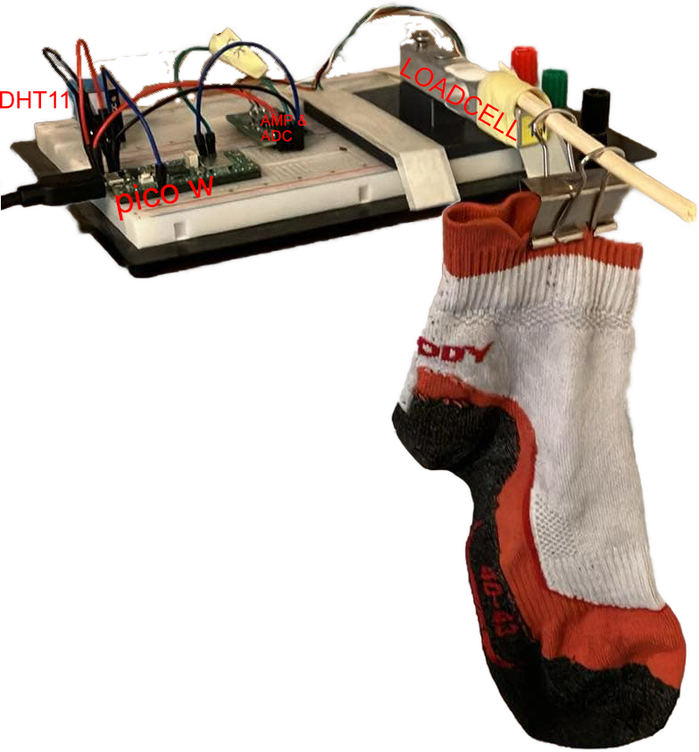
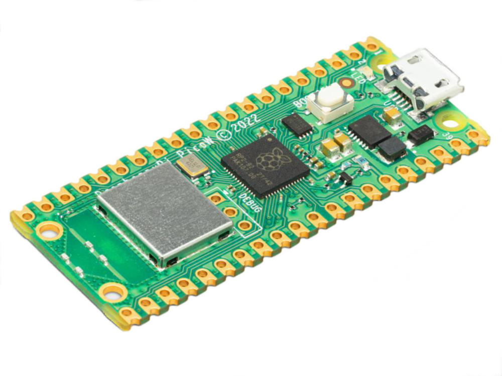
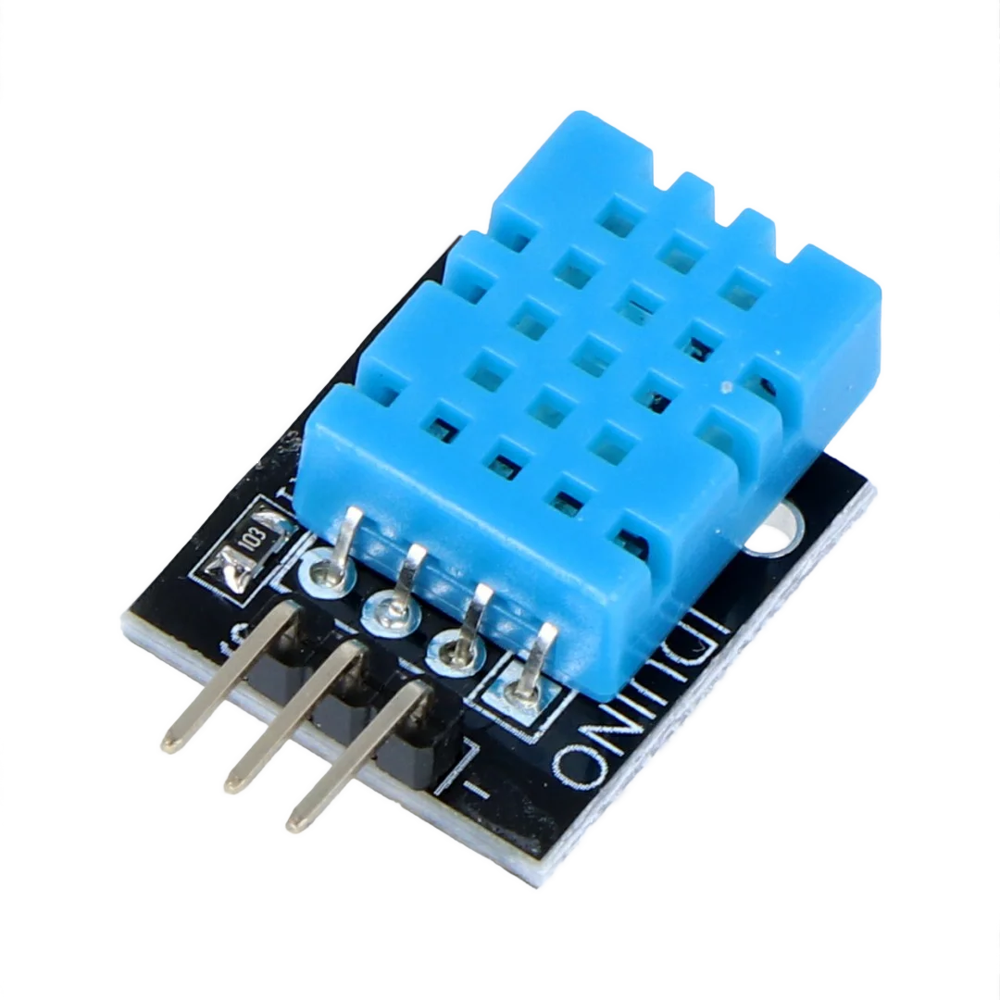
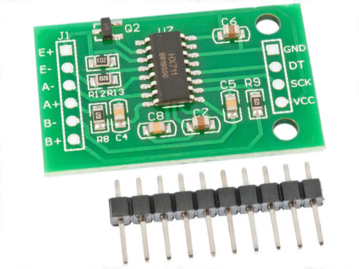
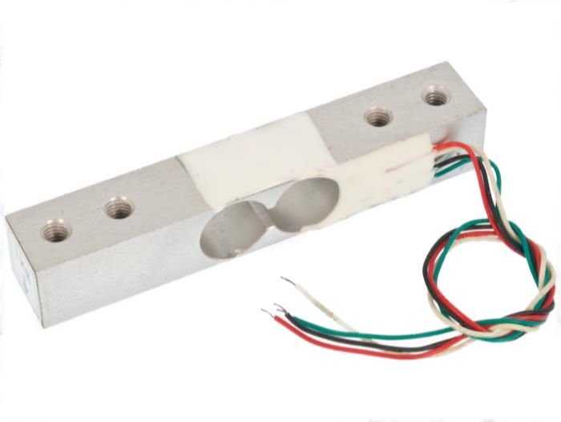
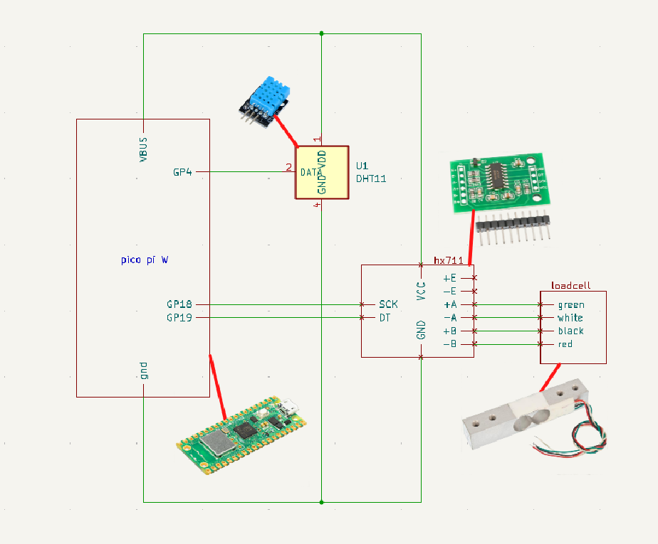
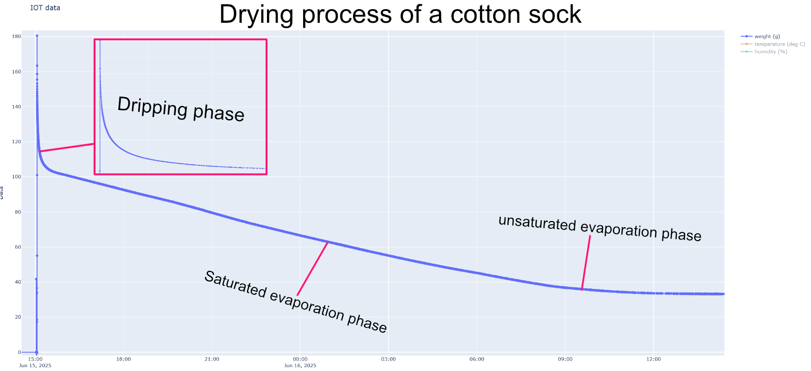
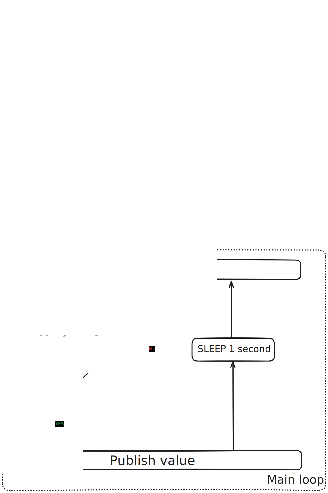
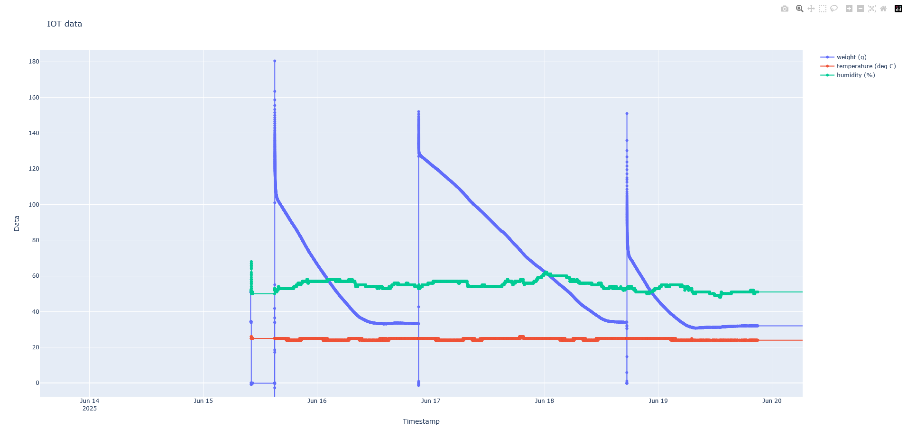

# IoT scale

_This is a project for the course 1DT305 - Applied IoT at LNU_ <br>
**Author:** Pontus Sjöstedt (ps223ue)

IoT-scale is a wifi-connected sensor that records temperature, humpidity, and, weight on a loadcell over time. This data is published over `MQTT` using `mosquitto` and aggregated in a `postgres` database. The data can then be quickly viewed using a primitive dashboard which consists of a `plotly` plot.



**Time estimate**: 4-8h

## Objective

This projects main objective was to better understand the sock drying process. The ultimate goal being to lessen the amount of suffering when experiencing type-2 fun (hiking) for the author.

## Main Features

### Sensor

- **Remote control:** can be remotley tared over MQTT.
- **Environment:** utilizes a `DHT11` sensor to meassure indoor temperature and humidity.
- **Loadcell:** meassures weight with a loadcell.

### Data Aggregation

Data aregation is done by a python script which stores meassurements published to the MQTT broker in a `postgres database`.

### DataVisualization

Data visualization is done by a `http-server` serving a `plotly` plot with data retrieved from the database.

## Materials

For this project I chose to use a `Raspberry Pi Pico W`. The choice was motivated by me having previous experience with them. They are also dirt cheap and I had one laying around at home already.

| Device                           | Description                                       | Price   | Store       |
| -------------------------------- | ------------------------------------------------- | ------- | ----------- |
|  | Raspberry Pi Pico WH, has builtin WiFi            | 99 SEK  | electro:kit |
|        | DHT11, meassures humidity and temperature.        | 49 SEK  | electro:kit |
|        | Load cell amplifier with 24bit ADC module - HX711 | 38 SEK  | electro:kit |
|      | Load cell 1kg, meassures weight                   | 129 SEK | electro:kit |

## Computer Setup

I am using [vscode](https://code.visualstudio.com/) as my IDE. In order to work with the `pico pi` I downloaded the `MicroPico` extension.

In order to be able to upload `micropython` code to the pico you need to flash it with the micropython firmware. How to do this can be found [here](https://micropython.org/download/RPI_PICO_W/).

You will also need to run [mosquitto](https://mosquitto.org/) and [postgres](https://www.postgresql.org/). Please refeer to their websites for setup. It will stay more up to date than this readme.

## Platform

I'm `self-hosting` the aggregator and visualization on my closet server. They are at the moment running as systemd services. This is convenient as they automatically start when my server starts. The closet server mk1 is very convenient since it's already on my LAN. It is also free since I already had one laying around.

## Putting it all together

The circuit can be seen bellow:

I built it on a breadboard I had laying around. It was also quite convenient that it weighs quite a lot and has rubber feet. This let me secure the loadcell to the breadboard by just 3D printing a small stand for it and taping it to the breadboard. It was then stable enough to hang weights up to the loadcells limit of 1kg.

## Sock Theory

In order to better understand the design choices made: one must familiarize themself with some of the sock theory hypothezised after running experiments with an earlier version of the scale.

### Phases

A hanging socks drying process can be divided into 3 phases. A plot of the drying process can be seen bellow:


#### The Dripping Phase

At first the driving sock drying factor was water dripping from the sock. The cause of this is likely gravity pushing water down to the lower parts of the sock where it is ejected as drops from the saturated fibers. The result is an exponential decay. During this phases the drying is the fastest. The dripping likely stops when there is not enough of a waterpillar to overpower the bonds between the sock fibers and the water molecules.

#### The saturated evaporation phase

After the dripping phase the entire air-sock interface (ASI) is damp but moisture stays put except for water going from less moist areas to more moist areas; except for a evaporation happening at the ASI. The result is a constant drying speed.

#### The unsaturated evaporation phase

In the terminal stages of the drying process the entire ASI is no longer wet. This reduces the surface area where evaporation can occur. The result is a decaying drying speed.

## The Code

### Aggregator

The core of the aggregator is this function:

```python
def on_message(client, userdata, msg):
    cur.execute("INSERT INTO data(topic, msg) VALUES (%s, %s)", (msg.topic, msg.payload.decode()))
    con.commit()
```

Which, is called whenever a new message is published on the scales channel, and, saves all MQTT messages to the database. The timestamp is filled in automatically by postgres as a default value.

I chose to use postgres as I had prior experience with it.

### Visualization

For visualization I have a http server built using `fastAPI`. It serves a `plotly` plot. The data comes directly from the database after some light manipulation using `pandas`. I chose to use fastAPI, plotly, and, pandas because I had prior experience with all of them.

### Embeded

The code follows roughly the following flow-chart

where new values are only published over `MQTT` if the meassured value is different enough from the last recorded value. This is important due to the changing rate of drying. In the `dripping phase` a lot of values are needed in a short time to see what happends. Meanwhile in the `saturated evaporation phase` and `unsaturated evaporation phase` the rate of change is much lower. This adaptive approach lets us get a high resolution in the `dripping phase` without taking an unreasonable amount of measurements during the remainder of the drying process.

## Transmitting the data / connectivity

The sensor uses wifi to communicate with the server of MQTT. This was chosen as it seemed to be the easiest combination. Power draw was not a concern as the sensor is not intended to be used outside of a lab enviornment with access to mains power.

Data is published as seen in the previous section (at most 1 time per second per data type).

## Presenting the data

The construction of the dashboard was previously explained in the code section. There is no mechanism for deleting data so it is retained until manually deleted. The dashboard can be seen bellow:


## Final Result

It works and is fun to play with. It looks like this:

